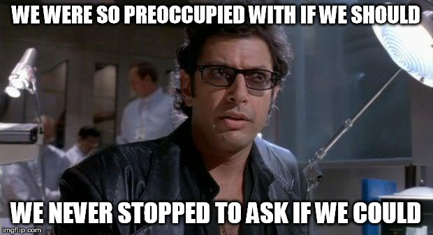
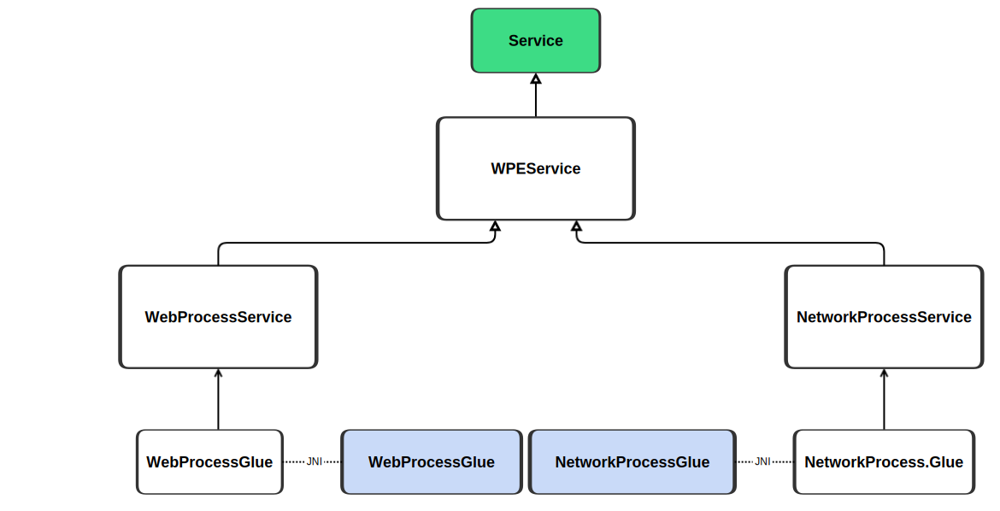
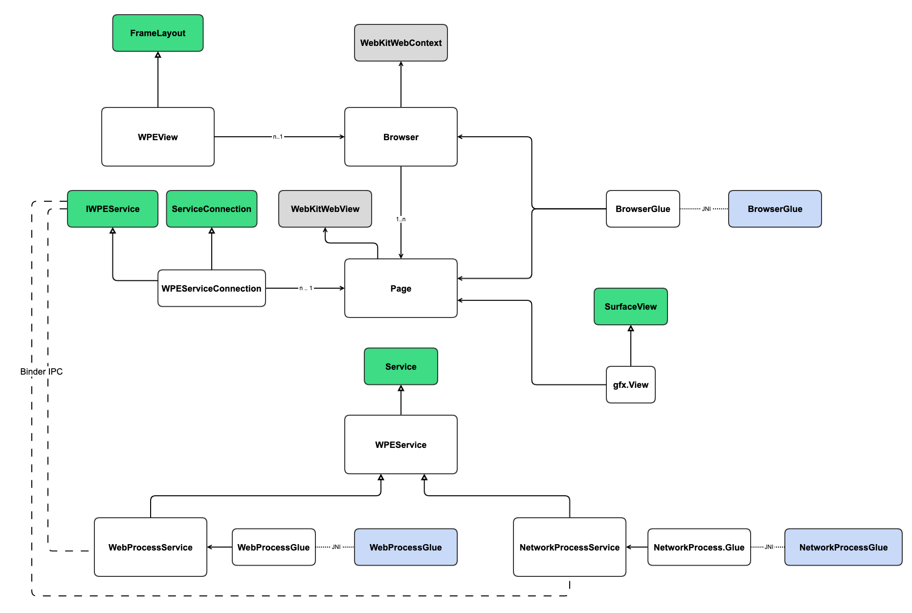
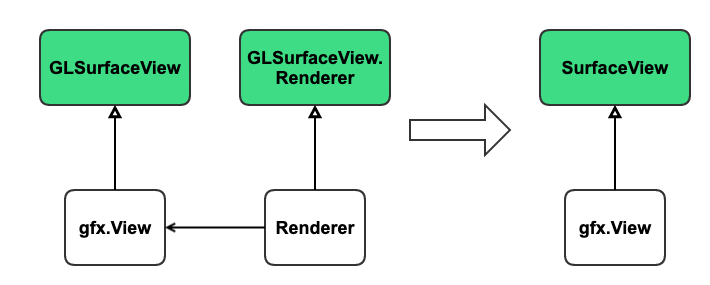

# WPE Android

##### Fernando Jiménez Moreno 
###### Igalia, September 2021
----
<!-- .slide: class="igalia-text-small" -->


----
<!-- .slide: class="igalia-text-small" -->
# History & motivations



Credits: Jeff Goldblum & Žan Doberšek

----
<!-- .slide: data-background-color="#000" -->
<figure class="video_container">
  <video src="https://ferjm.github.io/content/videos/2021/05/wpeandroid_may.mp4" controls height="490" autoplay frameborder="0" allowfullscreen="false">
  </video>
  <video src="public/bbb.mp4" controls height="490" autoplay allow="autoplay" frameborder="0" allowfullscreen="false">
  </video>
  <video src="https://ferjm.github.io/content/videos/2021/05/wpeandroid_fxr.mp4" controls height="480" autoplay frameborder="0" allowfullscreen="false">
  </video>
</figure>

----
<!-- .slide: data-background-image="public/lego.jpg" -->
# Building blocks
----
<!-- .slide: class="igalia-text-small" -->
# Build system

90+ dependencies

Cerbero from GStreamer

```python
class Recipe(recipe.Recipe):
    name = 'wpewebkit'
    version = '2.30.4'
    stype = SourceType.TARBALL
    btype = BuildType.CMAKE
    url = 'https://wpewebkit.org/releases/wpewebkit-{0}.tar.xz'.format(version)
```
```sh
python3 scripts/bootstrap --build
```
----
<!-- .slide: class="igalia-text-small" -->
# Build system

```python
self.patches += [
    'wpewebkit/0001-Android-remove-uses-of-shm_open-and-shm_unlink.patch',
    'wpewebkit/0001-Android-logging.patch',
    'wpewebkit/0001-Android-spawn-services.patch',
    'wpewebkit/0001-Android-web-network-process-entrypoint.patch',
    'wpewebkit/0001-Android-terminate-process.patch',
    'wpewebkit/0001-Android-disable-pson.patch',
    'wpewebkit/0001-Try-to-find-libz-with-pkg-config.patch',
    'wpewebkit/0001-Scroll-related-changes.patch',
    'wpewebkit/0001-PlatformDisplayLibWPE-use-eglGetPlatformDisplay-when.patch',
    'wpewebkit/0001-GLContextEGL-don-t-attempt-to-swap-buffers-for-surfa.patch',
    'wpewebkit/0001-ThreadedCompositor-allow-null-native-surface-handles.patch',
]
```
----
<!-- .slide: class="igalia-text-small" -->


----
<!-- .slide: class="igalia-text-small" -->
# WPEView
```java
void loadUrl(@NonNull String url)
boolean canGoBack()
boolean canGoForward()
void goBack()
void goForward()
void stopLoading()
void reload()
int getProgress()
String getTitle()
String getUrl()
String getOriginalUrl()
```
----
<!-- .slide: class="igalia-text-small" -->
# WPEView
```xml
<com.wpe.wpeview.WPEView
        android:id="@+id/wpe_view"
        android:layout_width="match_parent"
        android:layout_height="match_parent"
        tools:context=".MainActivity"/>
```
----
<!-- .slide: class="igalia-text-small" -->
# WPEView
```kotlin
override fun onCreate(savedInstanceState: Bundle?) {
    super.onCreate(savedInstanceState)
    setContentView(R.layout.activity_main)
    var browser = findViewById(R.id.wpe_view)
    browser?.loadUrl(INITIAL_URL)
}

```
----
<!-- .slide: class="igalia-text-small" -->
# Process Model


----
<!-- .slide: class="igalia-text-small" -->
# Process Model - PSON
----
<!-- .slide: class="igalia-text-small" -->
# Browser and Pages



----
<!-- .slide: class="igalia-text-small" -->
# WPE Backend

<a href="https://github.com/Igalia/WPEBackend-android">https://github.com/Igalia/WPEBackend-android</a>

----
<!-- .slide: class="igalia-text-small" -->
# gfx.View



<a href="https://developer.android.com/ndk/reference/group/a-hardware-buffer">https://developer.android.com/ndk/reference/group/a-hardware-buffer</a>
----
<!-- .slide: class="igalia-align-left igalia-text-small" -->
### Future work
<div class="igalia-columns">
  <p>h/w accelerated video playback</p>
    <p>PSON</p>
    <p>armv7, x86</p>
    <p>Emulator</p>
  	<p>Packaging and distribution</p>
    <p>Performance improvements</p>
    <p><a href="https://github.com/Igalia/wpe-android/issues">Many, many more</a></p>
</div>

----
<!-- .slide: class="igalia-text-small" -->
# Give it a try


<a href="https://cloud.igalia.com/s/E2sHHMRTwAHfCS7">https://cloud.igalia.com/s/E2sHHMRTwAHfCS7</a>
<a href="https://github.com/Igalia/wpe-android">https://github.com/Igalia/wpe-android</a>
----

## Thanks!

Any questions?

Ask ferjm@igalia.com for help!
----
<!-- .slide: data-middle-cover -->

